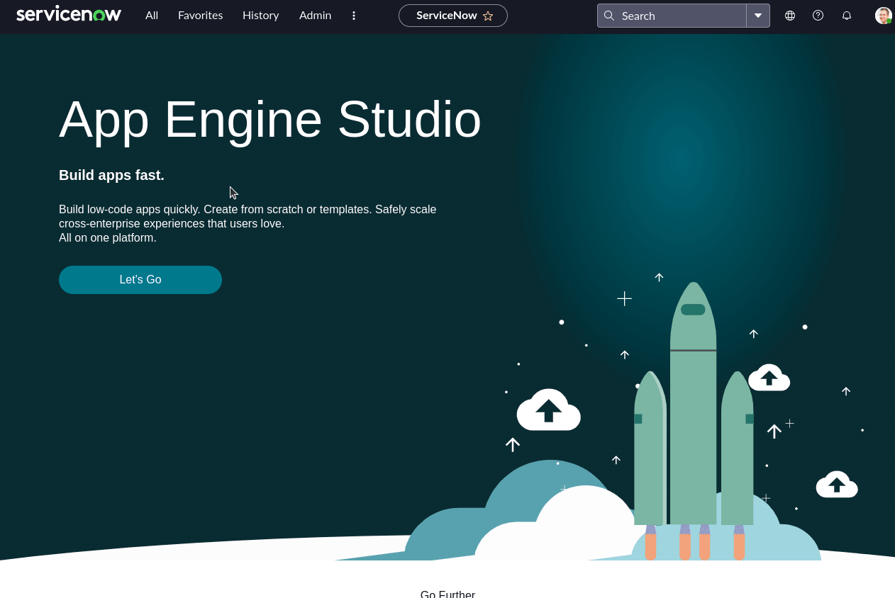

# Arista CVP to ServiceNow Import

This repository provides a simple example of importing CloudVision Portal (CVP) or CloudVision as-a-Service (CVaaS) devices to a ServiceNow instance. The ServiceNow instance used was provisioned through the ServiceNow [developer](https://developer.servicenow.com/) site.

This example will perform the following.

- Create Arista Networks as Manufacturer and Vendor
- Create device product model (7050QX-32, 7280SRAM-48C6, etc.)
- Create device (spine1, spine2, etc.)

## Setup a local environment

```shell
git clone
python3 -m venv venv
source venv/bin/activate
pip3 install -r requirements.txt
```

## Gathering the required credentials

We will need credentials from both ServiceNow and a CVP instance. If you head to the ServiceNow developer portal, you should have the option to manage instance passwords.

### ServiceNow credentials


After clicking on "Manage instance password", you should see a screen like below.


Take note of the instance name, username, and password.

### CloudVision credentials

This example uses a tenant within CVaaS and a service account token.

- Once logged in to your CVP instance, click on the gear on the top right.
  
- Click on Service Accounts
  
- Click New Service Account and enter a name and description
- Select `network-operator` as the role to have read-only privileges
- Click Add
  

Once this is complete, we will generate a token for our service account.

- Click on the newly created service account
- Under Generate Service Account Token, enter a description and expiration date
- Click Generate
- Make sure to copy the token, we will use this in the next step
- Click Save
  

### Set environment variables in .env file

This example uses a `.env` file to load the required credentials. An example has been included to simplify the process. Fill in the credentials with the appropriate information acquired so far.

```shell
cp .env.example .env
```

```txt
INSTANCE = dev123456
SNOW_USER = admin
SNOW_PASSWORD = "example"
CVP_HOST = https://www.example.com
CVP_TOKEN = super-secret-token
```

## Example

Below is our current ServiceNow instance with no Arista Networks manufacturer, vendor, device models, or Arista devices.



Below is an example view of the script execution.


Below is an example of our ServiceNow instance with Arista data populated.


## Using with offline data

If users do not have access to a CVP instance and would still like to test this tool, offline data is available with minor modifications to the `snow.py` file.

### Before

```py
from data import arista_networks, device_model, node_entry

headers = {"Authorization": f"Bearer {CVP_TOKEN}"}
dev = requests.get(
    url=f"{CVP_HOST}/cvpservice/inventory/devices?provisioned=false",
    headers=headers,
    verify=False,
    timeout=10,
)

devices = dev.json()
```

### After

```py
from data import arista_networks, devices, device_model, node_entry

# headers = {"Authorization": f"Bearer {CVP_TOKEN}"}
# dev = requests.get(
#     url=f"{CVP_HOST}/cvpservice/inventory/devices?provisioned=false",
#     headers=headers,
#     verify=False,
#     timeout=10,
# )

# devices = dev.json()
```

## Final thoughts

Thank you for taking a look at this example. Please fork this repository and submit a PR if you want to suggest modifications or improvements.
